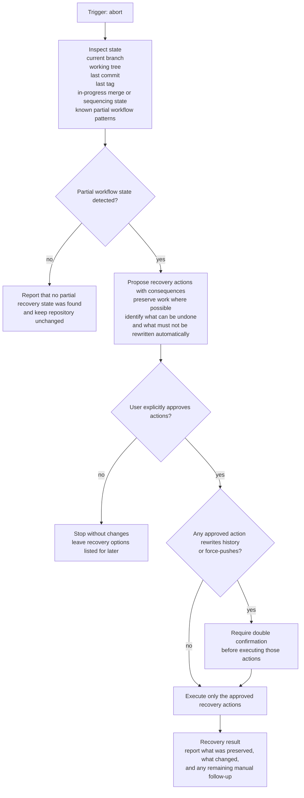

```mermaid
flowchart TD
    A["Trigger: abort"] --> B["Inspect state\ncurrent branch\nworking tree\nlast commit\nlast tag\nin-progress merge or sequencing state\nknown partial workflow patterns"]
    B --> C{"Partial workflow state detected?"}
    C -->|no| D["Report that no partial recovery state was found\nand keep repository unchanged"]
    C -->|yes| E["Propose recovery actions with consequences\npreserve work where possible\nidentify what can be undone\nand what must not be rewritten automatically"]
    E --> F{"User explicitly approves actions?"}
    F -->|no| G["Stop without changes\nleave recovery options listed for later"]
    F -->|yes| H{"Any approved action rewrites history\nor force-pushes?"}
    H -->|yes| I["Require double confirmation\nbefore executing those actions"]
    H -->|no| J["Execute only the approved recovery actions"]
    I --> J
    J --> K["Recovery result\nreport what was preserved, what changed,\nand any remaining manual follow-up"]
```
