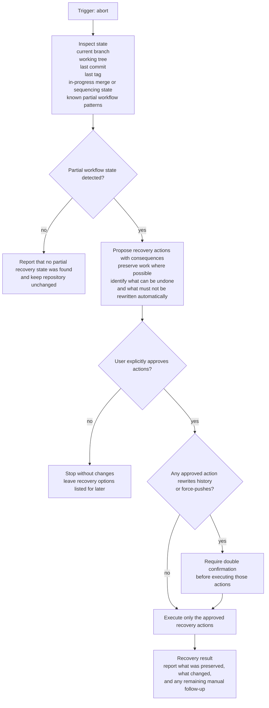

```mermaid
flowchart TD
    A["Trigger: abort"] --> B["Inspect state<br/>current branch<br/>working tree<br/>last commit<br/>last tag<br/>in-progress merge or sequencing state<br/>known partial workflow patterns"]
    B --> C{"Partial workflow state detected?"}
    C -->|no| D["Report that no partial recovery state was found<br/>and keep repository unchanged"]
    C -->|yes| E["Propose recovery actions with consequences<br/>preserve work where possible<br/>identify what can be undone<br/>and what must not be rewritten automatically"]
    E --> F{"User explicitly approves actions?"}
    F -->|no| G["Stop without changes<br/>leave recovery options listed for later"]
    F -->|yes| H{"Any approved action rewrites history<br/>or force-pushes?"}
    H -->|yes| I["Require double confirmation<br/>before executing those actions"]
    H -->|no| J["Execute only the approved recovery actions"]
    I --> J
    J --> K["Recovery result<br/>report what was preserved, what changed,<br/>and any remaining manual follow-up"]
```

