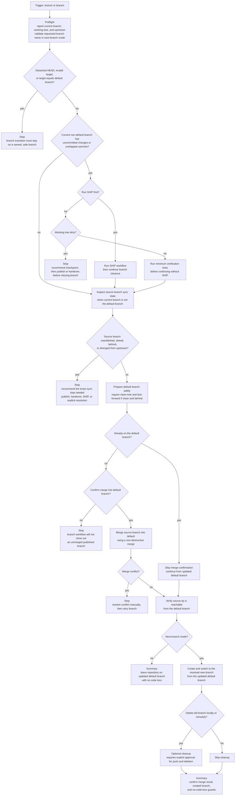

```mermaid
flowchart TD
    A["Trigger: branch or branch <new-branch-name>"] --> B["Preflight\nreport current branch, working tree, and upstream\nvalidate requested branch name in next-branch mode"]
    B --> C{"Detached HEAD, invalid target,\nor target equals default branch?"}
    C -->|yes| Z["Stop\nbranch transition must stay on a named, safe branch"]
    C -->|no| D{"Current non-default branch has\nuncommitted changes or unshipped commits?"}
    D -->|yes| E{"Run SHIP first?"}
    E -->|yes| F["Run SHIP workflow\nthen continue branch closeout"]
    E -->|no| G{"Working tree dirty?"}
    G -->|yes| H["Stop\nrecommend checkpoint, then publish or handover,\nbefore retrying branch"]
    G -->|no| I["Run minimum verification tests\nbefore continuing without SHIP"]
    D -->|no| J["Inspect source branch sync state\nwhen current branch is not the default branch"]
    F --> J
    I --> J
    J --> K{"Source branch unpublished, ahead, behind,\nor diverged from upstream?"}
    K -->|yes| L["Stop\nrecommend the exact sync step needed\npublish, handover, SHIP, or explicit resolution"]
    K -->|no| M["Prepare default branch safely\nrequire clean tree and fast-forward if clean and behind"]
    M --> N{"Already on the default branch?"}
    N -->|yes| O["Skip merge confirmation\ncontinue from updated default branch"]
    N -->|no| P{"Confirm merge into default branch?"}
    P -->|no| Q["Stop\nbranch workflow will not close out\nan unmerged published branch"]
    P -->|yes| R["Merge source branch into default\nusing a non-destructive merge"]
    R --> S{"Merge conflict?"}
    S -->|yes| T["Stop\nresolve conflict manually, then retry branch"]
    S -->|no| U["Verify source tip is reachable\nfrom the default branch"]
    O --> U
    U --> V{"Next-branch mode?"}
    V -->|no| W["Summary\nleave repository on updated default branch\nwith no code loss"]
    V -->|yes| X["Create and switch to the resolved new branch\nfrom the updated default branch"]
    X --> Y{"Delete old branch locally or remotely?"}
    Y -->|yes| AA["Optional cleanup\nrequires explicit approval for push and deletion"]
    Y -->|no| AB["Skip cleanup"]
    AA --> AC["Summary\nconfirm merge result, created branch,\nand no-code-loss guards"]
    AB --> AC
```
