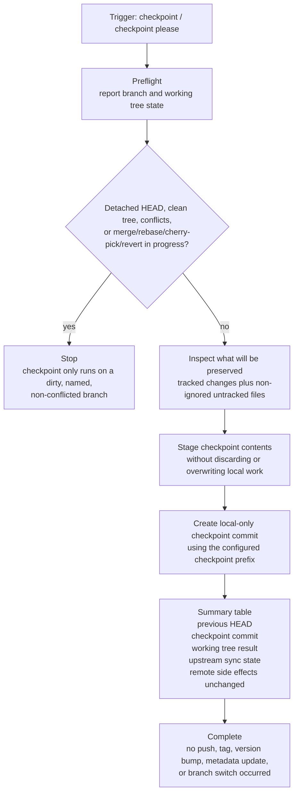

```mermaid
flowchart TD
    A["Trigger: checkpoint / checkpoint please"] --> B["Preflight<br/>report branch and working tree state"]
    B --> C{"Detached HEAD, clean tree, conflicts,<br/>or merge/rebase/cherry-pick/revert in progress?"}
    C -->|yes| D["Stop<br/>checkpoint only runs on a dirty, named,<br/>non-conflicted branch"]
    C -->|no| E["Inspect what will be preserved<br/>tracked changes plus non-ignored untracked files"]
    E --> F["Stage checkpoint contents<br/>without discarding or overwriting local work"]
    F --> G["Create local-only checkpoint commit<br/>using the configured checkpoint prefix"]
    G --> H["Summary table<br/>previous HEAD<br/>checkpoint commit<br/>working tree result<br/>upstream sync state<br/>remote side effects unchanged"]
    H --> I["Complete<br/>no push, tag, version bump, metadata update,<br/>or branch switch occurred"]
```

