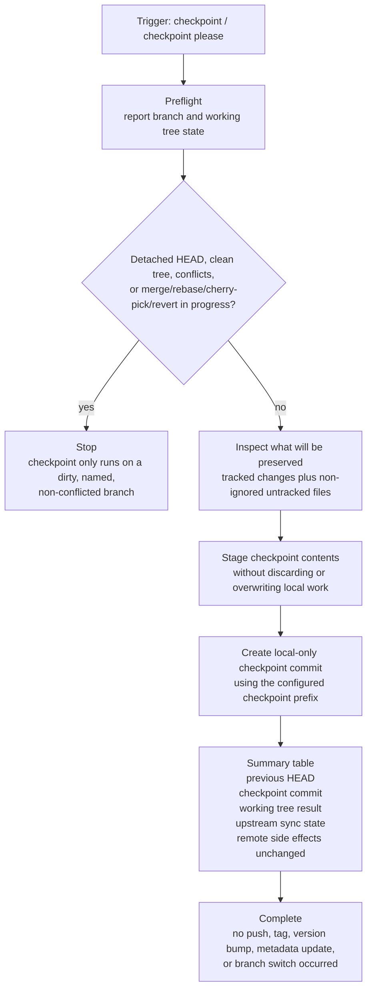

```mermaid
flowchart TD
    A["Trigger: checkpoint / checkpoint please"] --> B["Preflight\nreport branch and working tree state"]
    B --> C{"Detached HEAD, clean tree, conflicts,\nor merge/rebase/cherry-pick/revert in progress?"}
    C -->|yes| D["Stop\ncheckpoint only runs on a dirty, named,\nnon-conflicted branch"]
    C -->|no| E["Inspect what will be preserved\ntracked changes plus non-ignored untracked files"]
    E --> F["Stage checkpoint contents\nwithout discarding or overwriting local work"]
    F --> G["Create local-only checkpoint commit\nusing the configured checkpoint prefix"]
    G --> H["Summary table\nprevious HEAD\ncheckpoint commit\nworking tree result\nupstream sync state\nremote side effects unchanged"]
    H --> I["Complete\nno push, tag, version bump, metadata update,\nor branch switch occurred"]
```
