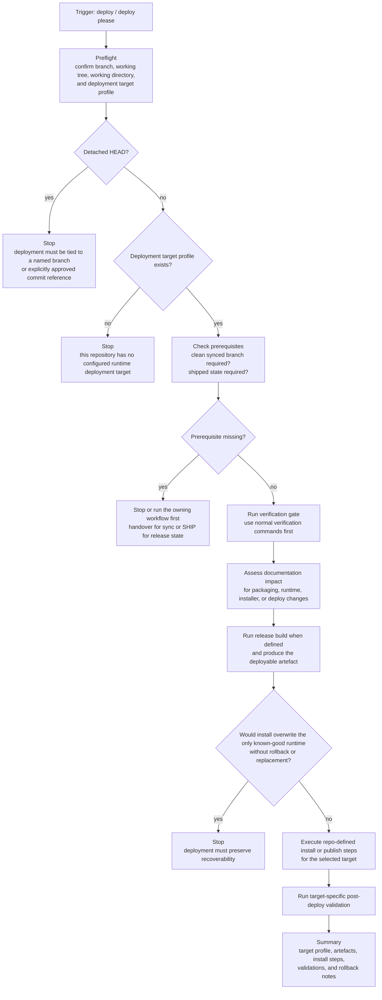

```mermaid
flowchart TD
    A["Trigger: deploy / deploy please"] --> B["Preflight<br/>confirm branch, working tree, working directory,<br/>and deployment target profile"]
    B --> C{"Detached HEAD?"}
    C -->|yes| Z["Stop<br/>deployment must be tied to a named branch<br/>or explicitly approved commit reference"]
    C -->|no| D{"Deployment target profile exists?"}
    D -->|no| Y["Stop<br/>this repository has no configured runtime deployment target"]
    D -->|yes| E["Check prerequisites<br/>clean synced branch required?<br/>shipped state required?"]
    E --> F{"Prerequisite missing?"}
    F -->|yes| G["Stop or run the owning workflow first<br/>handover for sync or SHIP for release state"]
    F -->|no| H["Run verification gate<br/>use normal verification commands first"]
    H --> I["Assess documentation impact<br/>for packaging, runtime, installer, or deploy changes"]
    I --> J["Run release build when defined<br/>and produce the deployable artefact"]
    J --> K{"Would install overwrite the only known-good runtime<br/>without rollback or replacement?"}
    K -->|yes| L["Stop<br/>deployment must preserve recoverability"]
    K -->|no| M["Execute repo-defined install or publish steps<br/>for the selected target"]
    M --> N["Run target-specific post-deploy validation"]
    N --> O["Summary<br/>target profile, artefacts, install steps,<br/>validations, and rollback notes"]
```

