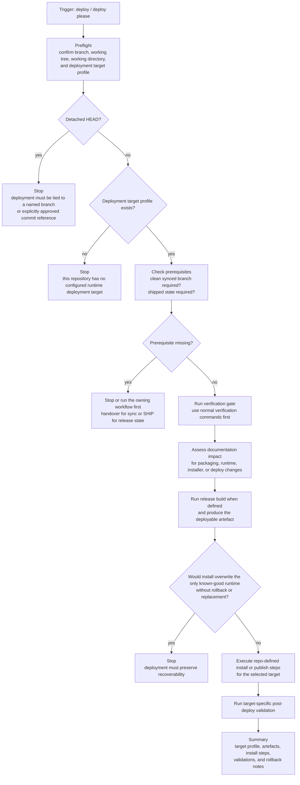

```mermaid
flowchart TD
    A["Trigger: deploy / deploy please"] --> B["Preflight\nconfirm branch, working tree, working directory,\nand deployment target profile"]
    B --> C{"Detached HEAD?"}
    C -->|yes| Z["Stop\ndeployment must be tied to a named branch\nor explicitly approved commit reference"]
    C -->|no| D{"Deployment target profile exists?"}
    D -->|no| Y["Stop\nthis repository has no configured runtime deployment target"]
    D -->|yes| E["Check prerequisites\nclean synced branch required?\nshipped state required?"]
    E --> F{"Prerequisite missing?"}
    F -->|yes| G["Stop or run the owning workflow first\nhandover for sync or SHIP for release state"]
    F -->|no| H["Run verification gate\nuse normal verification commands first"]
    H --> I["Assess documentation impact\nfor packaging, runtime, installer, or deploy changes"]
    I --> J["Run release build when defined\nand produce the deployable artefact"]
    J --> K{"Would install overwrite the only known-good runtime\nwithout rollback or replacement?"}
    K -->|yes| L["Stop\ndeployment must preserve recoverability"]
    K -->|no| M["Execute repo-defined install or publish steps\nfor the selected target"]
    M --> N["Run target-specific post-deploy validation"]
    N --> O["Summary\ntarget profile, artefacts, install steps,\nvalidations, and rollback notes"]
```
