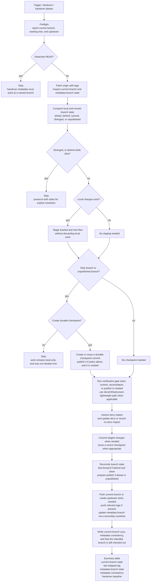

```mermaid
flowchart TD
    A["Trigger: handover / handover please"] --> B["Preflight\nreport current branch, working tree, and upstream"]
    B --> C{"Detached HEAD?"}
    C -->|yes| Z["Stop\nhandover metadata must point at a named branch"]
    C -->|no| D["Fetch origin with tags\ninspect current branch and metadata branch state"]
    D --> E["Compare local and remote branch state\nahead, behind, synced, diverged, or unpublished"]
    E --> F{"Diverged, or behind while dirty?"}
    F -->|yes| Y["Stop\npreserve both sides for explicit resolution"]
    F -->|no| G{"Local changes exist?"}
    G -->|yes| H["Stage tracked and new files\nwithout discarding local work"]
    G -->|no| I["No staging needed"]
    H --> J{"Dirty branch or unpublished branch?"}
    I --> J
    J -->|yes| K{"Create durable checkpoint?"}
    K -->|no| X["Stop\nwork remains local-only and was not handed over"]
    K -->|yes| L["Create or reuse a durable checkpoint commit\npublish it if policy allows and it is needed"]
    J -->|no| M["No checkpoint needed"]
    L --> N["Run verification gate when commit, reconciliation,\nor publish is needed\nuse docs/infrastructure lightweight path when applicable"]
    M --> N
    N --> O["Assess docs impact\nand update docs or record no docs impact"]
    O --> P["Commit staged changes when needed\nreuse a recent checkpoint when appropriate"]
    P --> Q["Reconcile branch state\nfast-forward if behind and clean\nprepare publish if ahead or unpublished"]
    Q --> R["Push current branch or create upstream when needed\npush relevant tags if present\nupdate metadata branch via a secondary worktree"]
    R --> S["Verify current branch sync, metadata consistency,\nand that the intended branch is still checked out"]
    S --> T["Summary table\ncurrent branch state\nlast shipped tag\nmetadata branch state\nmetadata consistency\nhandover baseline"]
```
