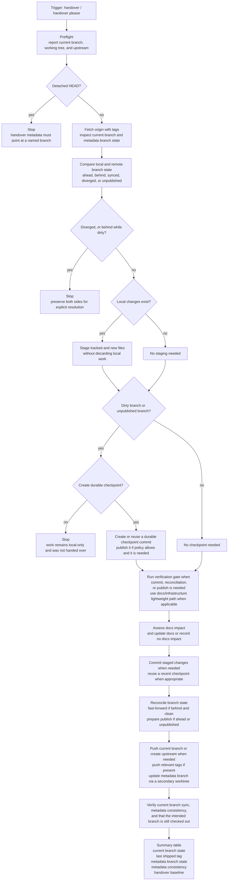

```mermaid
flowchart TD
    A["Trigger: handover / handover please"] --> B["Preflight<br/>report current branch, working tree, and upstream"]
    B --> C{"Detached HEAD?"}
    C -->|yes| Z["Stop<br/>handover metadata must point at a named branch"]
    C -->|no| D["Fetch origin with tags<br/>inspect current branch and metadata branch state"]
    D --> E["Compare local and remote branch state<br/>ahead, behind, synced, diverged, or unpublished"]
    E --> F{"Diverged, or behind while dirty?"}
    F -->|yes| Y["Stop<br/>preserve both sides for explicit resolution"]
    F -->|no| G{"Local changes exist?"}
    G -->|yes| H["Stage tracked and new files<br/>without discarding local work"]
    G -->|no| I["No staging needed"]
    H --> J{"Dirty branch or unpublished branch?"}
    I --> J
    J -->|yes| K{"Create durable checkpoint?"}
    K -->|no| X["Stop<br/>work remains local-only and was not handed over"]
    K -->|yes| L["Create or reuse a durable checkpoint commit<br/>publish it if policy allows and it is needed"]
    J -->|no| M["No checkpoint needed"]
    L --> N["Run verification gate when commit, reconciliation,<br/>or publish is needed<br/>use docs/infrastructure lightweight path when applicable"]
    M --> N
    N --> O["Assess docs impact<br/>and update docs or record no docs impact"]
    O --> P["Commit staged changes when needed<br/>reuse a recent checkpoint when appropriate"]
    P --> Q["Reconcile branch state<br/>fast-forward if behind and clean<br/>prepare publish if ahead or unpublished"]
    Q --> R["Push current branch or create upstream when needed<br/>push relevant tags if present<br/>update metadata branch via a secondary worktree"]
    R --> S["Verify current branch sync, metadata consistency,<br/>and that the intended branch is still checked out"]
    S --> T["Summary table<br/>current branch state<br/>last shipped tag<br/>metadata branch state<br/>metadata consistency<br/>handover baseline"]
```

