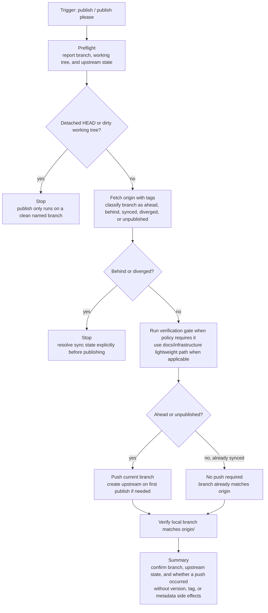

```mermaid
flowchart TD
    A["Trigger: publish / publish please"] --> B["Preflight\nreport branch, working tree, and upstream state"]
    B --> C{"Detached HEAD or dirty working tree?"}
    C -->|yes| Z["Stop\npublish only runs on a clean named branch"]
    C -->|no| D["Fetch origin with tags\nclassify branch as ahead, behind, synced, diverged, or unpublished"]
    D --> E{"Behind or diverged?"}
    E -->|yes| Y["Stop\nresolve sync state explicitly before publishing"]
    E -->|no| F["Run verification gate when policy requires it\nuse docs/infrastructure lightweight path when applicable"]
    F --> G{"Ahead or unpublished?"}
    G -->|yes| H["Push current branch\ncreate upstream on first publish if needed"]
    G -->|no, already synced| I["No push required\nbranch already matches origin"]
    H --> J["Verify local branch matches origin/<current-branch>"]
    I --> J
    J --> K["Summary\nconfirm branch, upstream state, and whether a push occurred\nwithout version, tag, or metadata side effects"]
```
