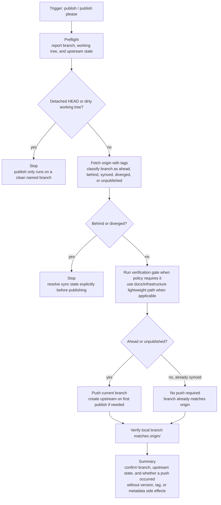

```mermaid
flowchart TD
    A["Trigger: publish / publish please"] --> B["Preflight<br/>report branch, working tree, and upstream state"]
    B --> C{"Detached HEAD or dirty working tree?"}
    C -->|yes| Z["Stop<br/>publish only runs on a clean named branch"]
    C -->|no| D["Fetch origin with tags<br/>classify branch as ahead, behind, synced, diverged, or unpublished"]
    D --> E{"Behind or diverged?"}
    E -->|yes| Y["Stop<br/>resolve sync state explicitly before publishing"]
    E -->|no| F["Run verification gate when policy requires it<br/>use docs/infrastructure lightweight path when applicable"]
    F --> G{"Ahead or unpublished?"}
    G -->|yes| H["Push current branch<br/>create upstream on first publish if needed"]
    G -->|no, already synced| I["No push required<br/>branch already matches origin"]
    H --> J["Verify local branch matches origin/<current-branch>"]
    I --> J
    J --> K["Summary<br/>confirm branch, upstream state, and whether a push occurred<br/>without version, tag, or metadata side effects"]
```

