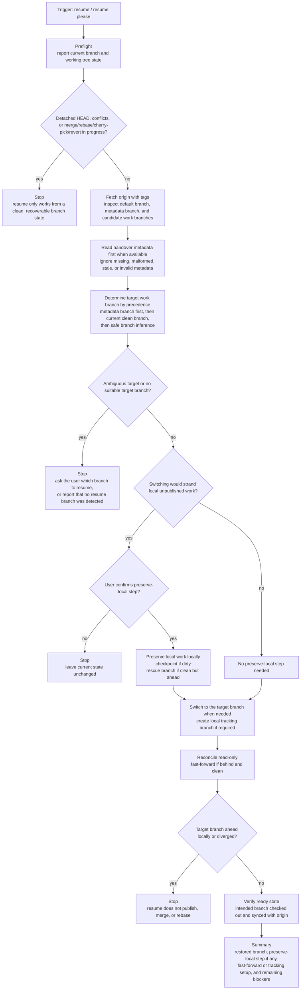

```mermaid
flowchart TD
    A["Trigger: resume / resume please"] --> B["Preflight\nreport current branch and working tree state"]
    B --> C{"Detached HEAD, conflicts, or merge/rebase/cherry-pick/revert in progress?"}
    C -->|yes| Z["Stop\nresume only works from a clean, recoverable branch state"]
    C -->|no| D["Fetch origin with tags\ninspect default branch, metadata branch, and candidate work branches"]
    D --> E["Read handover metadata first when available\nignore missing, malformed, stale, or invalid metadata"]
    E --> F["Determine target work branch by precedence\nmetadata branch first, then current clean branch,\nthen safe branch inference"]
    F --> G{"Ambiguous target or no suitable target branch?"}
    G -->|yes| Y["Stop\nask the user which branch to resume,\nor report that no resume branch was detected"]
    G -->|no| H{"Switching would strand local unpublished work?"}
    H -->|yes| I{"User confirms preserve-local step?"}
    I -->|no| X["Stop\nleave current state unchanged"]
    I -->|yes| J["Preserve local work locally\ncheckpoint if dirty\nrescue branch if clean but ahead"]
    H -->|no| K["No preserve-local step needed"]
    J --> L["Switch to the target branch when needed\ncreate local tracking branch if required"]
    K --> L
    L --> M["Reconcile read-only\nfast-forward if behind and clean"]
    M --> N{"Target branch ahead locally or diverged?"}
    N -->|yes| W["Stop\nresume does not publish, merge, or rebase"]
    N -->|no| O["Verify ready state\nintended branch checked out and synced with origin"]
    O --> P["Summary\nrestored branch, preserve-local step if any,\nfast-forward or tracking setup, and remaining blockers"]
```
