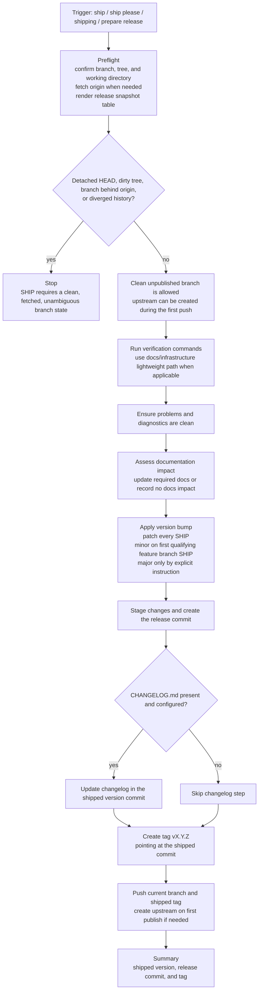

```mermaid
flowchart TD
    A["Trigger: ship / ship please / shipping / prepare release"] --> B["Preflight\nconfirm branch, tree, and working directory\nfetch origin when needed\nrender release snapshot table"]
    B --> C{"Detached HEAD, dirty tree, branch behind origin,\nor diverged history?"}
    C -->|yes| Z["Stop\nSHIP requires a clean, fetched, unambiguous branch state"]
    C -->|no| D["Clean unpublished branch is allowed\nupstream can be created during the first push"]
    D --> E["Run verification commands\nuse docs/infrastructure lightweight path when applicable"]
    E --> F["Ensure problems and diagnostics are clean"]
    F --> G["Assess documentation impact\nupdate required docs or record no docs impact"]
    G --> H["Apply version bump\npatch every SHIP\nminor on first qualifying feature branch SHIP\nmajor only by explicit instruction"]
    H --> I["Stage changes and create the release commit"]
    I --> J{"CHANGELOG.md present and configured?"}
    J -->|yes| K["Update changelog in the shipped version commit"]
    J -->|no| L["Skip changelog step"]
    K --> M["Create tag vX.Y.Z\npointing at the shipped commit"]
    L --> M
    M --> N["Push current branch and shipped tag\ncreate upstream on first publish if needed"]
    N --> O["Summary\nshipped version, release commit, and tag"]
```
