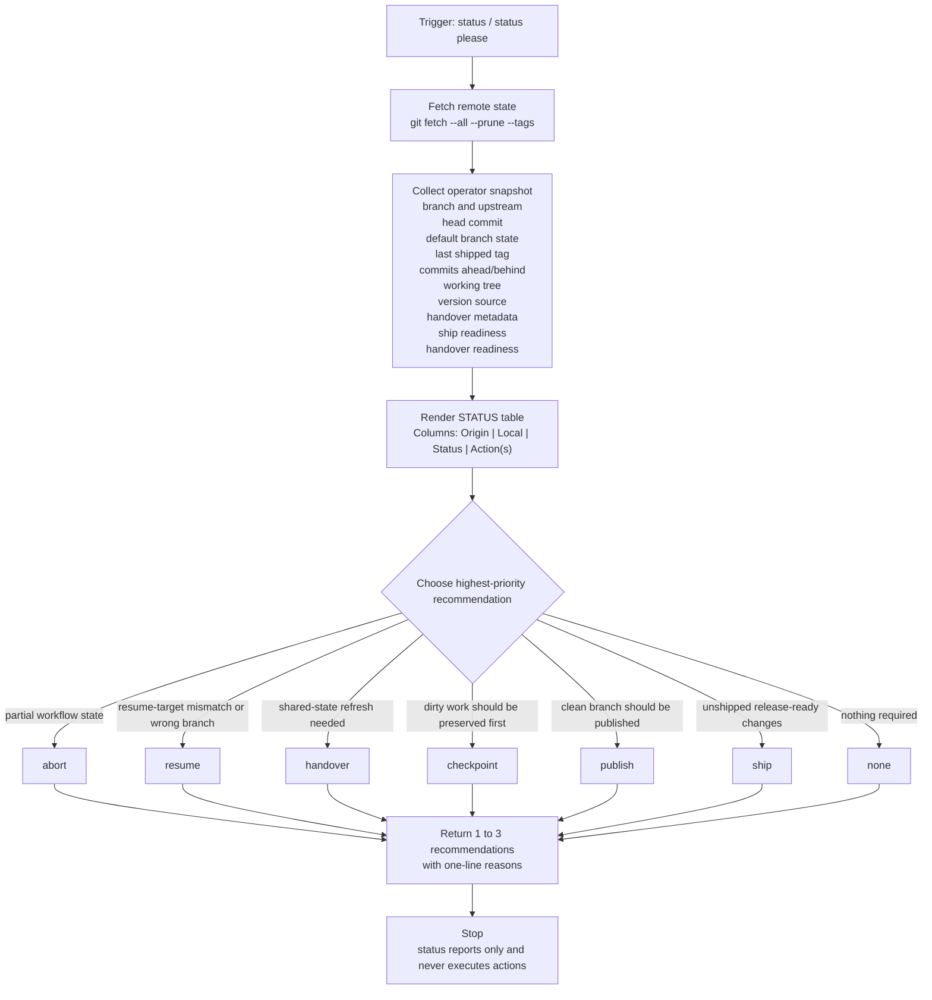

```mermaid
flowchart TD
    A["Trigger: status / status please"] --> B["Fetch remote state<br/>git fetch --all --prune --tags"]
    B --> C["Collect operator snapshot<br/>branch and upstream<br/>head commit<br/>default branch state<br/>last shipped tag<br/>commits ahead/behind<br/>working tree<br/>version source<br/>handover metadata<br/>ship readiness<br/>handover readiness"]
    C --> D["Render STATUS table<br/>Columns: Origin | Local | Status | Action(s)"]
    D --> E{"Choose highest-priority recommendation"}
    E -->|partial workflow state| F["abort"]
    E -->|resume-target mismatch or wrong branch| G["resume"]
    E -->|shared-state refresh needed| H["handover"]
    E -->|dirty work should be preserved first| I["checkpoint"]
    E -->|clean branch should be published| J["publish"]
    E -->|unshipped release-ready changes| K["ship"]
    E -->|nothing required| L["none"]
    F --> M["Return 1 to 3 recommendations<br/>with one-line reasons"]
    G --> M
    H --> M
    I --> M
    J --> M
    K --> M
    L --> M
    M --> N["Stop<br/>status reports only and never executes actions"]
```

