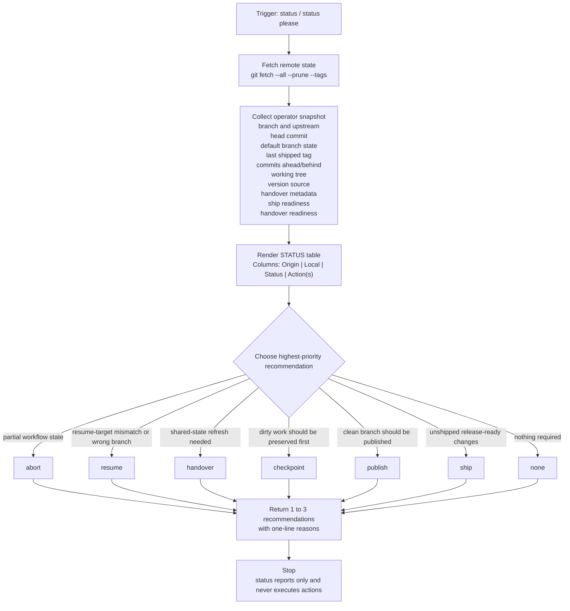

```mermaid
flowchart TD
    A["Trigger: status / status please"] --> B["Fetch remote state\ngit fetch --all --prune --tags"]
    B --> C["Collect operator snapshot\nbranch and upstream\nhead commit\ndefault branch state\nlast shipped tag\ncommits ahead/behind\nworking tree\nversion source\nhandover metadata\nship readiness\nhandover readiness"]
    C --> D["Render STATUS table\nColumns: Origin | Local | Status | Action(s)"]
    D --> E{"Choose highest-priority recommendation"}
    E -->|partial workflow state| F["abort"]
    E -->|resume-target mismatch or wrong branch| G["resume"]
    E -->|shared-state refresh needed| H["handover"]
    E -->|dirty work should be preserved first| I["checkpoint"]
    E -->|clean branch should be published| J["publish"]
    E -->|unshipped release-ready changes| K["ship"]
    E -->|nothing required| L["none"]
    F --> M["Return 1 to 3 recommendations\nwith one-line reasons"]
    G --> M
    H --> M
    I --> M
    J --> M
    K --> M
    L --> M
    M --> N["Stop\nstatus reports only and never executes actions"]
```
